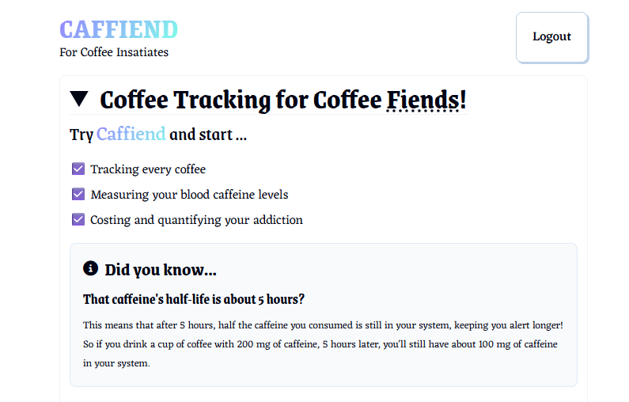
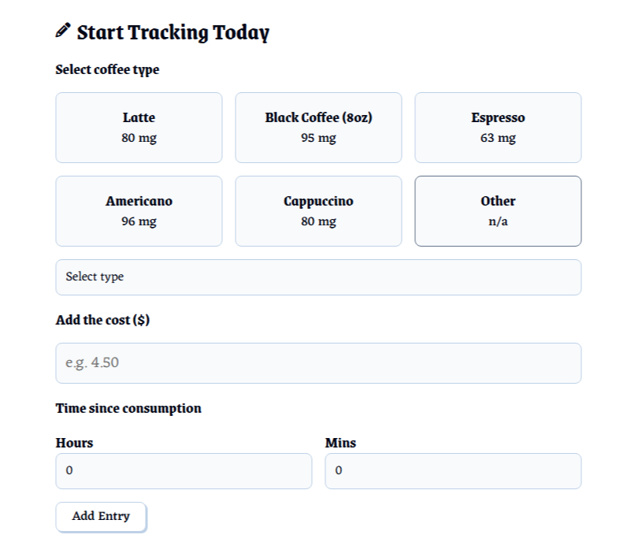
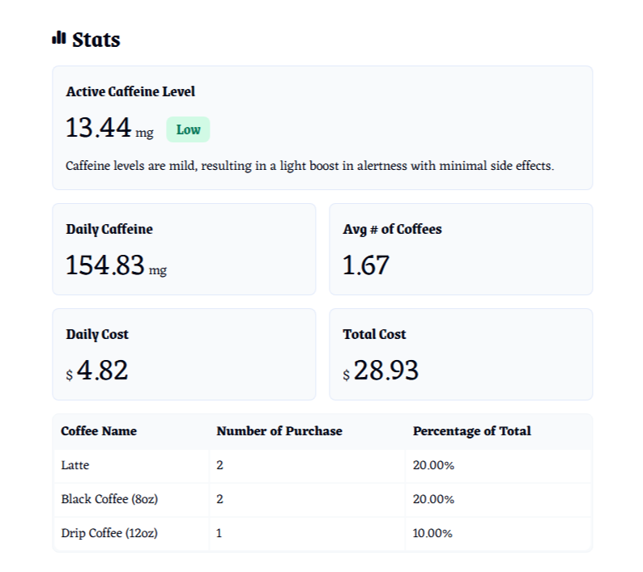
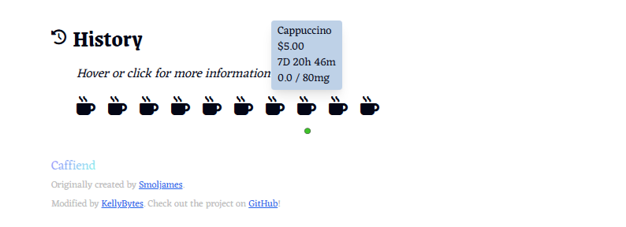
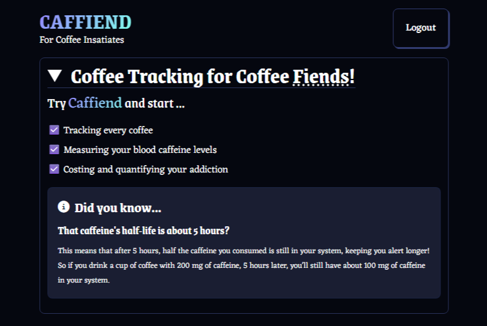
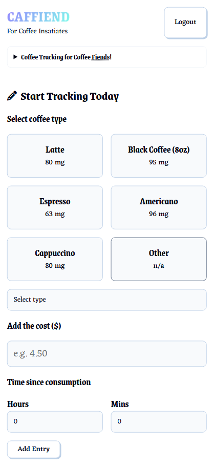

# ReactJS Caffeine Tracking App

Originally created by [jamezmca](https://github.com/jamezmca)

---

## Overview

This is a web application that help you track your caffeine consumption.

### Features

- Record types, costs, and time when you take drink containing caffeine
- Show stats including caffeine level, average daily caffeine, average number of coffees, average daily cost, and total cost
- Show history
- Authentication with email and password
- Store data in Firestore Database
- Responsive design
- **[Fix]** Prevent zooming in when inputting the cost on mobile screens
- **[New]** Show/hide the hero section
- **[New]** Sort coffee types by count for easier selection
- **[New]** Show history by hovering or clicking
- **[New]** Add Reset Password functionality

### Built With

- ReactJS
- FantaCSS
- Firebase

---

## Screenshots

**Desktop**

  

 

Input and Stats

  
  

  

 

History

  

 

Dark Mode

  

 

**Mobile**

  
  

  

 
